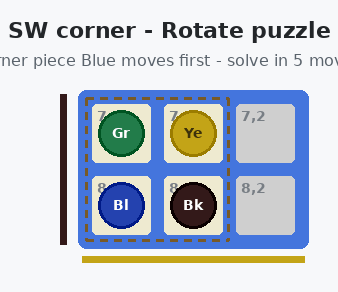

# Quoridor Corner Puzzles

A self-contained mini puzzle game spun off from the 4-player Quoridor project.
Rearrange four pawns in a board corner into a target arrangement - every puzzle
has a provably optimal solution (found by BFS, verified by the game engine).

**8 puzzles** (4 board corners x Swap / Rotate types) - a hint button re-solves
from your live position in a background worker, par + star ratings included.

## Play

Live demo: works out of the box on GitHub Pages (static site, no build step) -
just enable Pages on this repo, or open `index.html` locally.

Open `index.html` in a browser (double-clicking works - hints run in a web
worker from the same folder; if your browser blocks workers on file://, serve
the folder with any static server, e.g. `python3 -m http.server`).

- Pick a puzzle in the selector under the title (8 puzzles: 4 board corners x
  Swap / Rotate; sorted easiest first)
- Rearrange the marked 2x2 corner block into the **target** shown at the side
- Turn order is fixed (Yellow > Black > Blue > Green); every pawn moves every
  turn; steps, straight jumps and diagonal jumps allowed; no walls; no pawn
  may ever land on its own goal line (the colored edge bars); moves stay in
  the un-shaded region
- **hint** re-solves the puzzle from the live position (provably shortest,
  in a background worker) and shows the next best move
- Stars: 3 at par, 2 within par+2, else 1

## Files

    index.html       page: selector, board, stats, hint button
    style.css        original Quoridor style + minigame additions
    js/game.js       rules engine (copied unchanged from the 4-player game)
    js/solver.js     BFS solver (provably optimal, used for hints)
    js/hint_worker.js  background solver thread
    js/puzzles.js    the 8 puzzles (generated from the engine-verified dataset)
    js/view.js       rendering
    js/controller.js game flow

All puzzle data was generated by exhaustive search and validated against the
real game engine. ## Credits & License

Engine derived from [Kyutae Lee's Quoridor AI](https://github.com/gorisanson/quoridor-ai)
(MIT), adapted to 4 players, then spun off into this puzzle game. See `LICENSE`.

## Tests

`tests/` contains a logic test (all puzzles solvable at par through the real
engine, hints correct from mid-game states). Run with `bash tests/run.sh`
(needs Node.js; no other dependencies).
